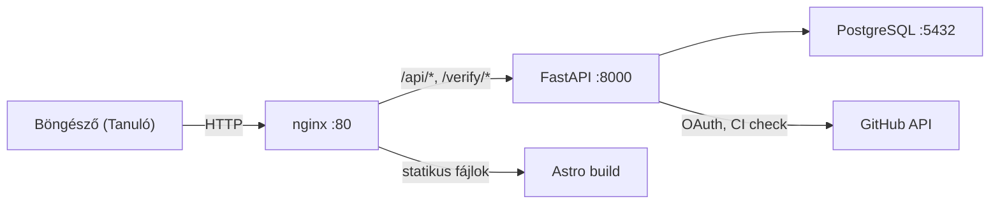
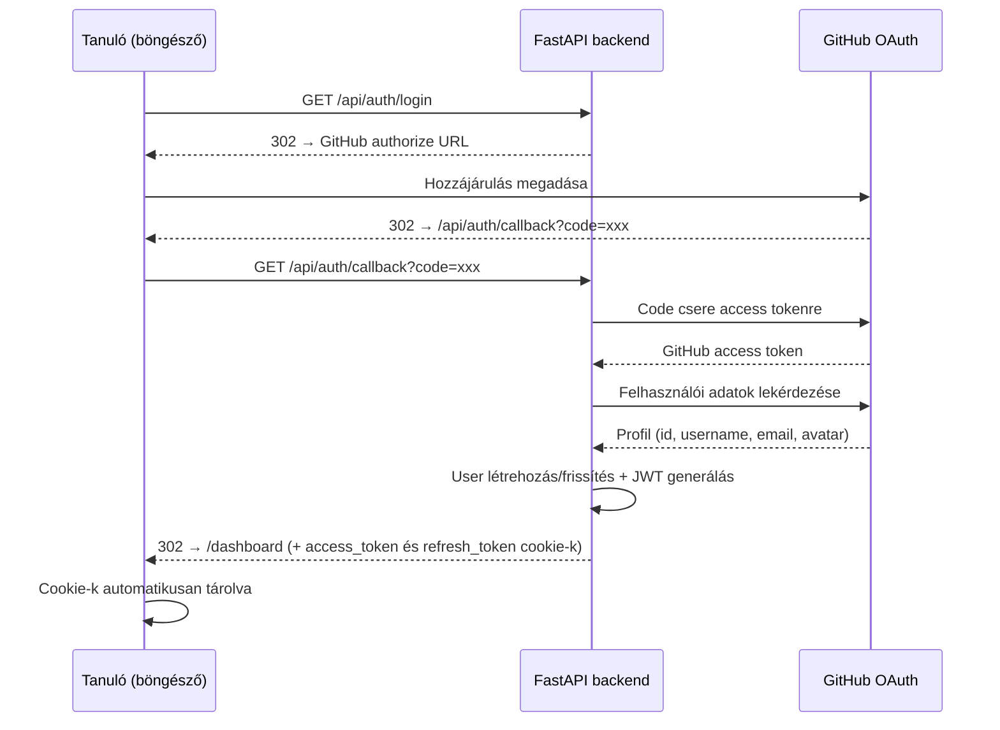
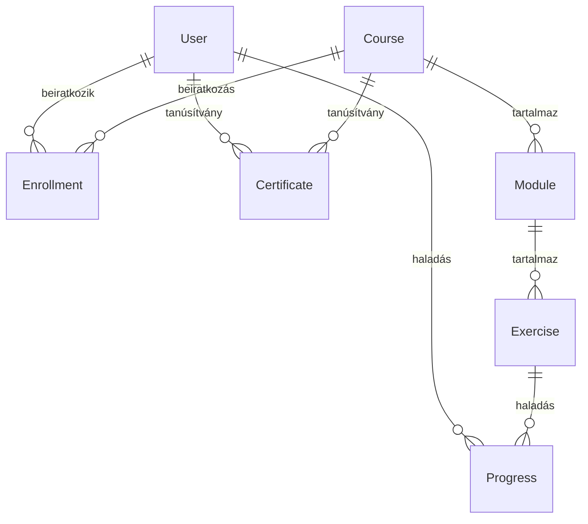
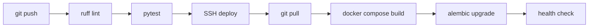

# OpenSchool Platform — Architektúra

> 📖 **Dokumentáció:** [Főoldal](../../README.md) · **Architektúra** · [Telepítés](telepitesi-utmutato.md) · [Környezeti változók](kornyezeti-valtozok.md) · [Fejlesztői útmutató](../development/fejlesztoi-utmutato.md) · [Backend](../development/backend-fejlesztes.md) · [Frontend](../development/frontend-fejlesztes.md) · [Tesztelés](../development/tesztelesi-utmutato.md) · [API referencia](../reference/api-referencia.md) · [Adatbázis](../reference/adatbazis-sema.md) · [Karbantartás](../operations/karbantartas-utmutato.md) · [Automatizálás](../operations/automatizalas-beallitas.md) · [GitHub Classroom](../integrations/github-classroom-integraciot.md) · [Discord](../integrations/discord-integracio.md) · [Felhasználói útmutató](../guides/felhasznaloi-utmutato.md) · [Dokumentálás](../guides/dokumentacios-utmutato.md) · [Roadmap](../jovokep-es-fejlesztesi-terv.md) · [Hozzájárulás](../../CONTRIBUTING.md)

## Rendszer áttekintés

Az OpenSchool egy oktatási platform, ahol a tanulók valódi fejlesztői munkafolyamatokon keresztül tanulnak programozni. A platform kurzusokat kezel, követi a haladást, GitHub-bal integrálódik az azonosításhoz és a CI-alapú értékeléshez, valamint hitelesíthető tanúsítványokat állít ki.



### Kérés útvonala

1. Minden forgalom az **nginx**-en keresztül érkezik a 80-as porton (vagy 443 SSL-lel)
2. Az `/api/*` és `/verify/*` kérések a **FastAPI backend**-re proxyződnak
3. Minden más kérés az Astro által épített **statikus fájlokat** szolgálja ki
4. A backend a **PostgreSQL**-lel kommunikál az adattároláshoz
5. A backend a **GitHub API**-t hívja az OAuth-hoz és a CI állapot ellenőrzéshez

---

## Backend (FastAPI)

### Könyvtárstruktúra

```
backend/
├── app/
│   ├── main.py              # FastAPI alkalmazás, router regisztráció
│   ├── config.py             # Beállítások (pydantic-settings, .env olvasás)
│   ├── database.py           # SQLAlchemy engine, session, Base
│   ├── auth/
│   │   ├── jwt.py            # Token létrehozás és ellenőrzés (HS256)
│   │   └── dependencies.py   # get_current_user, require_role
│   ├── models/
│   │   ├── user.py           # User (github_id, role, stb.)
│   │   ├── course.py         # Course, Module, Exercise, Enrollment, Progress
│   │   └── certificate.py    # Certificate (UUID, PDF útvonal)
│   ├── routers/
│   │   ├── admin.py          # /api/admin/* — admin panel (statisztikák, felhasználók, törlés)
│   │   ├── auth.py           # /api/auth/* — OAuth, bejelentkezés, profil
│   │   ├── certificates.py   # /api/me/certificates/*, /api/verify/*
│   │   ├── courses.py        # /api/courses/* — CRUD, beiratkozás, modulok
│   │   ├── dashboard.py      # /api/me/* — haladás, dashboard
│   │   └── webhooks.py       # /api/webhooks/* — GitHub webhook fogadás
│   └── services/
│       ├── certificate.py    # is_course_completed() — teljesítés ellenőrzés
│       ├── pdf.py            # PDF generálás fpdf2-vel
│       ├── qr.py             # QR kód generálás
│       ├── github.py         # GitHub Actions állapot lekérdezés
│       └── progress.py       # Haladás frissítés GitHub CI alapján
├── alembic/                  # Adatbázis migrációk
├── tests/                    # pytest tesztek
└── requirements.txt
```

### Azonosítási folyamat



### Szerepkör-alapú hozzáférés

| Szerepkör | Jogosultságok |
|-----------|---------------|
| `student` | Beiratkozás kurzusokra, haladás megtekintése, tanúsítvány igénylése |
| `mentor` | Minden, amit a student + tanulók haladásának megtekintése |
| `admin` | Minden + kurzusok/modulok/gyakorlatok CRUD, felhasználók kezelése, admin panel |

### Adatmodell



**Táblák részletesen:**

| Tábla | Kulcs mezők |
|-------|-------------|
| `users` | github_id, username, email, avatar_url, role (student/mentor/admin), github_token |
| `courses` | name, description |
| `modules` | course_id, name, order |
| `exercises` | module_id, name, repo_prefix, order, required, classroom_url |
| `enrollments` | user_id, course_id, enrolled_at |
| `progress` | user_id, exercise_id, status (not_started/in_progress/completed), github_repo |
| `certificates` | cert_id (UUID), user_id, course_id, issued_at, pdf_path |

---

## Frontend (Astro)

### Oldalak

| Útvonal | Azonosítás | Leírás |
|---------|------------|--------|
| `/` | Nem | Kezdőoldal — bemutató, hogyan működik, kurzus előnézet |
| `/courses` | Nem | Kurzuslista |
| `/courses/[slug]` | Nem | Kurzus részletei modulokkal, gyakorlatokkal, beiratkozás gomb |
| `/login` | Nem | GitHub OAuth bejelentkezés, token kezelés |
| `/dashboard` | Igen | Beiratkozott kurzusok, haladási sávok, tanúsítványok |
| `/verify/[id]` | Nem | Nyilvános tanúsítvány hitelesítés |
| `/admin` | Igen (admin) | Admin dashboard — statisztikák |
| `/admin/users` | Igen (admin) | Felhasználók kezelése, szerepkörök módosítása |
| `/admin/courses` | Igen (admin) | Kurzusok, modulok, gyakorlatok kezelése |

### Statikus kimenet

Az Astro statikus HTML/CSS/JS fájlokat generál. A build kimenetet az nginx szolgálja ki. A böngészőből érkező API hívások a `/api/*` útvonalra mennek, amit az nginx a backend-re proxyzi.

---

## Infrastruktúra

### Docker Compose szolgáltatások

| Szolgáltatás | Image | Cél |
|-------------|-------|-----|
| `backend` | Python 3.12 slim | FastAPI alkalmazás uvicorn-nal |
| `db` | PostgreSQL 16 | Adattárolás |
| `nginx` | nginx:alpine | Reverse proxy + statikus fájl kiszolgálás |
| `frontend` | Node 20 (csak build) | Astro statikus fájlok buildelése |

### Éles vs. fejlesztői különbségek (`docker-compose.prod.yml`)

- `restart: always` minden szolgáltatáson
- A backend portja nem elérhető kívülről (csak nginx-en keresztül)
- Nincs kód volume mount (az image-be beépítve)
- Healthcheck-ek konfigurálva
- Log rotáció bekapcsolva

### nginx útvonalak

```
/api/*      → proxy_pass http://backend:8000
/verify/*   → proxy_pass http://backend:8000/api/verify/
/health     → proxy_pass http://backend:8000
/*          → statikus fájlok (Astro build) SPA fallback-kel
```

---

## CI/CD



### CI Pipeline (`.github/workflows/ci.yml`)

Mikor fut: push a `main` vagy `develop`-re, PR-ek a `main` vagy `develop`-re

1. Checkout → Python 3.12 beállítás → Függőségek telepítése → pytest futtatás → Discord értesítés

### CD Pipeline (`.github/workflows/cd.yml`)

Mikor fut: push a `main` vagy `develop` ágra (csak ha a `VPS_HOST` repository variable be van állítva)

1. SSH belépés a VPS-re → git pull → docker compose build → alembic migrate → health check → Discord értesítés

---

## Kulcs függőségek

| Csomag | Cél |
|--------|-----|
| `fastapi` | Web keretrendszer |
| `sqlalchemy` | ORM (adatbázis kezelés) |
| `alembic` | Adatbázis migrációk |
| `pydantic-settings` | Konfiguráció környezeti változókból |
| `PyJWT` | JWT tokenek |
| `httpx` | HTTP kliens a GitHub API-hoz |
| `fpdf2` | Tanúsítvány PDF generálás |
| `qrcode` | QR kód generálás tanúsítványokhoz |
| `psycopg2-binary` | PostgreSQL driver |
| `slowapi` | Rate limiting (API végpontok védelme) |
| `pytest` | Tesztelés |
