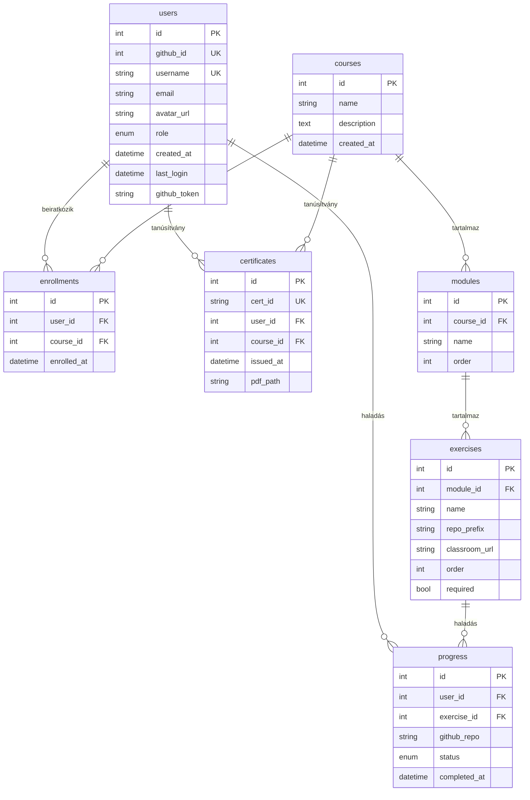

# OpenSchool Platform — Adatbázis séma

> 📖 **Dokumentáció:** [Főoldal](../../README.md) · [Architektúra](../getting-started/architektura.md) · [Telepítés](../getting-started/telepitesi-utmutato.md) · [Környezeti változók](../getting-started/kornyezeti-valtozok.md) · [Fejlesztői útmutató](../development/fejlesztoi-utmutato.md) · [Backend](../development/backend-fejlesztes.md) · [Frontend](../development/frontend-fejlesztes.md) · [Tesztelés](../development/tesztelesi-utmutato.md) · [API referencia](api-referencia.md) · **Adatbázis** · [Karbantartás](../operations/karbantartas-utmutato.md) · [Automatizálás](../operations/automatizalas-beallitas.md) · [GitHub Classroom](../integrations/github-classroom-integraciot.md) · [Discord](../integrations/discord-integracio.md) · [Felhasználói útmutató](../guides/felhasznaloi-utmutato.md) · [Dokumentálás](../guides/dokumentacios-utmutato.md) · [Roadmap](../jovokep-es-fejlesztesi-terv.md) · [Hozzájárulás](../../CONTRIBUTING.md)

Ez a dokumentum az adatbázis teljes sémáját és a táblák közötti kapcsolatokat írja le.

---

## Áttekintés

Az adatbázis SQLAlchemy ORM-mel van definiálva, Alembic migrációkkal kezelve. Fejlesztésben SQLite, élesben PostgreSQL 16 a backend.



---

## Táblák részletesen

### `users`

A GitHub OAuth-tal regisztrált felhasználók. Minden felhasználónak egyedi `github_id`-ja és `username`-je van.

| Oszlop | Típus | Nullable | Default | Leírás |
|--------|-------|----------|---------|--------|
| `id` | Integer | — | autoincrement | Elsődleges kulcs |
| `github_id` | Integer | Nem | — | GitHub felhasználó azonosító (egyedi) |
| `username` | String | Nem | — | GitHub felhasználónév (egyedi). Bejelentkezéskor frissül |
| `email` | String | Igen | — | Email cím a GitHub profilból (lehet `null`, ha privát) |
| `avatar_url` | String | Igen | — | GitHub profilkép URL-je. Bejelentkezéskor frissül |
| `role` | Enum | Nem | `student` | Szerepkör: `student`, `mentor`, `admin`. Admin módosíthatja |
| `created_at` | DateTime | Igen | `now()` | Regisztráció időpontja (első bejelentkezés) |
| `last_login` | DateTime | Igen | — | Utolsó bejelentkezés időpontja. Minden login-kor frissül |
| `github_token` | String | Igen | — | GitHub access token a CI állapot lekérdezéséhez. Minden login-kor frissül. A `sync-progress` végpont használja |

**Egyedi megszorítások:** `github_id` (unique), `username` (unique)

---

### `courses`

A kurzusok (pl. „Python 10", „Backend 13"). Adminok hozhatják létre, nyilvánosan megjelennek.

| Oszlop | Típus | Nullable | Default | Leírás |
|--------|-------|----------|---------|--------|
| `id` | Integer | — | autoincrement | Elsődleges kulcs |
| `name` | String | Nem | — | Kurzus neve |
| `description` | Text | Igen | — | Kurzus leírása |
| `created_at` | DateTime | Igen | `now()` | Létrehozás időpontja |

**Kapcsolatok:**
- `modules` — 1:N — a kurzus moduljai (`Module.order` szerint rendezve)
- `enrollments` — 1:N — a kurzusra beiratkozott felhasználók

---

### `modules`

A kurzusok moduljai (feladatcsoportok). Sorrendjüket az `order` mező határozza meg.

| Oszlop | Típus | Nullable | Default | Leírás |
|--------|-------|----------|---------|--------|
| `id` | Integer | — | autoincrement | Elsődleges kulcs |
| `course_id` | Integer (FK) | Nem | — | Szülő kurzus (`courses.id`) |
| `name` | String | Nem | — | Modul neve |
| `order` | Integer | Igen | `0` | Megjelenítési sorrend (növekvő). A modulok ezt a sorrendet követik a felületen |

---

### `exercises`

A feladatok (gyakorlatok), modulokhoz rendelve. Minden feladat opcionálisan egy GitHub Classroom assignment-hez köthető.

| Oszlop | Típus | Nullable | Default | Leírás |
|--------|-------|----------|---------|--------|
| `id` | Integer | — | autoincrement | Elsődleges kulcs |
| `module_id` | Integer (FK) | Nem | — | Szülő modul (`modules.id`) |
| `name` | String | Nem | — | Feladat neve |
| `repo_prefix` | String | Igen | — | GitHub Classroom repó prefix. A diákok repói `{prefix}-{username}` formátumúak (pl. `python10-hello-diak1`). A webhook és a sync-progress ezzel egyezteti a feladatot |
| `classroom_url` | String | Igen | — | GitHub Classroom assignment link (pl. `https://classroom.github.com/a/abc123`). A frontend megjeleníti — erre kattintva a diák elfogadja a feladatot |
| `order` | Integer | Igen | `0` | Megjelenítési sorrend a modulon belül |
| `required` | Boolean | Nem | `true` | Ha `true`, a feladat teljesítése szükséges a tanúsítvány kiállításához. Ha `false`, opcionális (nem számít a befejezettségbe) |

> **`repo_prefix` + `username` egyeztetés:** Amikor a GitHub Classroom létrehoz egy repót, az `{prefix}-{github-username}` formában kapja a nevét. A webhook és a sync-progress ezt a konvenciót használja a feladatok automatikus párosításához.

---

### `enrollments`

Beiratkozási rekordok — melyik felhasználó melyik kurzusra iratkozott be.

| Oszlop | Típus | Nullable | Default | Leírás |
|--------|-------|----------|---------|--------|
| `id` | Integer | — | autoincrement | Elsődleges kulcs |
| `user_id` | Integer (FK) | Nem | — | Felhasználó (`users.id`) |
| `course_id` | Integer (FK) | Nem | — | Kurzus (`courses.id`) |
| `enrolled_at` | DateTime | Igen | `now()` | Beiratkozás időpontja |

> **Megjegyzés:** Nincs unique constraint a `(user_id, course_id)` párra az adatbázis szinten — az `enroll` végpont kódban ellenőrzi a duplikációt (`409` hiba).

---

### `progress`

Feladatok haladási állapota — egy felhasználó egy feladathoz egy rekordot kap.

| Oszlop | Típus | Nullable | Default | Leírás |
|--------|-------|----------|---------|--------|
| `id` | Integer | — | autoincrement | Elsődleges kulcs |
| `user_id` | Integer (FK) | Nem | — | Felhasználó (`users.id`) |
| `exercise_id` | Integer (FK) | Nem | — | Feladat (`exercises.id`) |
| `github_repo` | String | Igen | — | A GitHub repó neve (pl. `python10-hello-diak1`). A webhook frissítéskor tölti ki |
| `status` | Enum | Nem | `not_started` | Állapot: `not_started`, `in_progress`, `completed` |
| `completed_at` | DateTime | Igen | — | Befejezés időpontja. Csak `completed` státuszhoz van kitöltve |

**Státuszok:**

| Érték | Leírás |
|-------|--------|
| `not_started` | A felhasználó még nem kezdte el |
| `in_progress` | Elkezdve, de nem kész |
| `completed` | Teljesítve — a CI zöld, vagy manuálisan jelölve |

**Ki frissítheti:**
1. **Felhasználó manuálisan**: `POST /api/me/courses/{id}/progress`
2. **GitHub webhook**: automatikusan, ha a CI fut sikeres
3. **Sync-progress**: `POST /api/me/sync-progress` — lekérdezi a GitHub API-t

---

### `certificates`

Kiállított tanúsítványok. Minden tanúsítványhoz UUID generálódik és opcionálisan PDF készül.

| Oszlop | Típus | Nullable | Default | Leírás |
|--------|-------|----------|---------|--------|
| `id` | Integer | — | autoincrement | Elsődleges kulcs |
| `cert_id` | String | Nem | `uuid4()` | Publikus UUID azonosító. Ez jelenik meg a verifikációs URL-ben: `/verify/{cert_id}` |
| `user_id` | Integer (FK) | Nem | — | Felhasználó (`users.id`) |
| `course_id` | Integer (FK) | Nem | — | Kurzus (`courses.id`) |
| `issued_at` | DateTime | Igen | `now()` | Kiállítás időpontja |
| `pdf_path` | String | Igen | — | Generált PDF fájl útvonala (`data/certificates/{cert_id}.pdf`). Ha a PDF generálás sikertelen (hiányzó `fpdf2` csomag), `null` marad |

**Egyedi megszorítások:** `cert_id` (unique), `(user_id, course_id)` (unique — egy kurzushoz egy tanúsítvány)

---

## Kapcsolatok összefoglaló

| Forrás | Cél | Típus | FK | Leírás |
|--------|-----|-------|----|----|
| `modules` | `courses` | N:1 | `course_id` | Modul tartozik kurzushoz |
| `exercises` | `modules` | N:1 | `module_id` | Feladat tartozik modulhoz |
| `enrollments` | `users` | N:1 | `user_id` | Beiratkozás → felhasználó |
| `enrollments` | `courses` | N:1 | `course_id` | Beiratkozás → kurzus |
| `progress` | `users` | N:1 | `user_id` | Haladás → felhasználó |
| `progress` | `exercises` | N:1 | `exercise_id` | Haladás → feladat |
| `certificates` | `users` | N:1 | `user_id` | Tanúsítvány → felhasználó |
| `certificates` | `courses` | N:1 | `course_id` | Tanúsítvány → kurzus |

---

## Kaszkád törlés

Az `DELETE /api/admin/courses/{id}` végpont manuálisan törli a függő rekordokat:

```
Course törlés:
  → Module-ok törlése
    → Exercise-ek törlése
      → Progress rekordok törlése
  → Enrollment-ek törlése
  → Certificate-ek törlése
```

> **Megjegyzés:** A kaszkád törlés az alkalmazás kódban valósul meg (nem adatbázis-szintű `ON DELETE CASCADE`), a `synchronize_session=False` beállítással a teljesítmény érdekében.

---

## Alembic migrációk

Az adatbázis séma változásait Alembic migrációk kezelik:

```bash
# Migráció futtatása
make migrate          # = alembic upgrade head

# Új migráció generálása (séma módosítás után)
cd backend
alembic revision --autogenerate -m "leírás"

# Visszagörgetés egy lépéssel
alembic downgrade -1
```

### Meglévő migrációk

| Fájl | Leírás |
|------|--------|
| `5492c9d27e5f` | `users` tábla létrehozása |
| `38fa8a895630` | `courses`, `modules`, `exercises`, `enrollments`, `progress` táblák |
| `a1b2c3d4e5f6` | `github_token` oszlop hozzáadása (`users`) + `classroom_url` (`exercises`) |
| `cefa39428d67` | `certificates` tábla + `required` oszlop (`exercises`) |

### Migráció létrehozási folyamat

1. Módosítsd a modell fájlt (`backend/app/models/*.py`)
2. Generáld a migrációt: `alembic revision --autogenerate -m "leírás"`
3. Ellenőrizd a generált fájlt (`backend/alembic/versions/...`)
4. Futtasd: `alembic upgrade head`
5. Teszteld: `make test`
